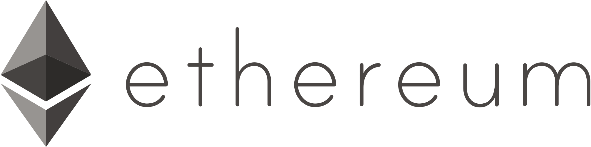

# Document hashes on Ethereum blockchain from Java

Storing and reading document hashes on the Ethereum blockchain from Java.


---

# Table of Contents

* [About the Project](#about-the-project)
* [Getting Started](#getting-started)
  * [Prerequisites](#prerequisites)
  * [Installation](#installation)
* [Usage](#usage)
* [License](#license)

# About the Project

<table>
  <tr>
    <td>
        
    </td>
    <td>
        
    </td>
    <td>
        
    </td>
    <td>
        
    </td>
  </tr>
</table>

This project demonstrate **document hash** storing on the **Ethereum blockchain** from **Java**.

This is a **Java Spring Boot** application with a **ZK** frontend, that use an embedded **H2** database for demonstration purpose.

# Getting Started

## Prerequisites

To run this project in a local environment, you need :
- a local Ethereum blockchain running on `localhost` on port `7545`
- A `Diploma` smart contract deployed to handle document hash read and write

See the [eth-hash-chain](https://github.com/Yann39/eth-hash-chain) project for setting up a local blockchain with all the required capabilities.

## Installation

1. Clone the repository :
    ```shell script
    git clone https://github.com/Yann39/eth-hash-app
    ```
2. Replace `application.account-address` and `application.contract-address` values in _application.properties_
   to match your account and smart contract addresses according to your running blockchain
3. Build the JAR file using **Maven** :
   ```shell script
   mvn package
   ```
4. Start your local blockchain
5. Execute application from Intellij or run the JAR file, with the right profile :
   ```shell script
   java -Dspring.profiles.active=local -jar /target/eth-hash-app.jar
   ```
6. Reach <http://localhost:8080/>

# Usage

Simply reach the application home page at <http://localhost:8080/> to display the home page.

Navigate to the **Documents** menu, or direct access : <http://localhost:8080/diplomas>

Then simply add documents and try to save hashes to the Ethereum blockchain.

# License

[General Public License (GPL) v3](https://www.gnu.org/licenses/gpl-3.0.en.html)

This program is free software: you can redistribute it and/or modify it under the terms of the GNU
General Public License as published by the Free Software Foundation, either version 3 of the
License, or (at your option) any later version.

This program is distributed in the hope that it will be useful, but WITHOUT ANY WARRANTY; without
even the implied warranty of MERCHANTABILITY or FITNESS FOR A PARTICULAR PURPOSE. See the GNU
General Public License for more details.

You should have received a copy of the GNU General Public License along with this program. If not,
see <http://www.gnu.org/licenses/>.